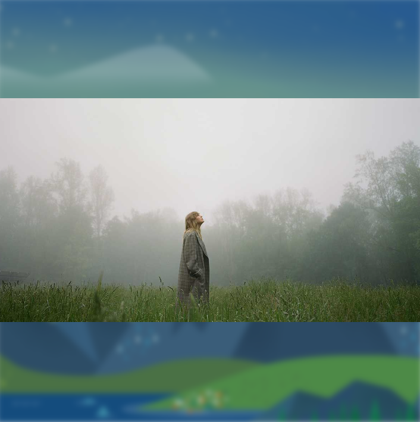
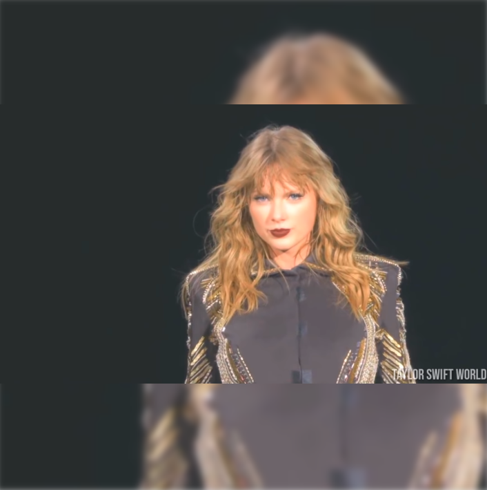

# Image Resizer

This is a simple image resizer that resizes an image to a square.

To get started, all you need to do is copy the image you want to resize as the `image.jpg`  and the background as `bg.jpg` file.

**Note:** The background image and the image to be resized can be the same image to create a layered effect for social media post.

## Examples

